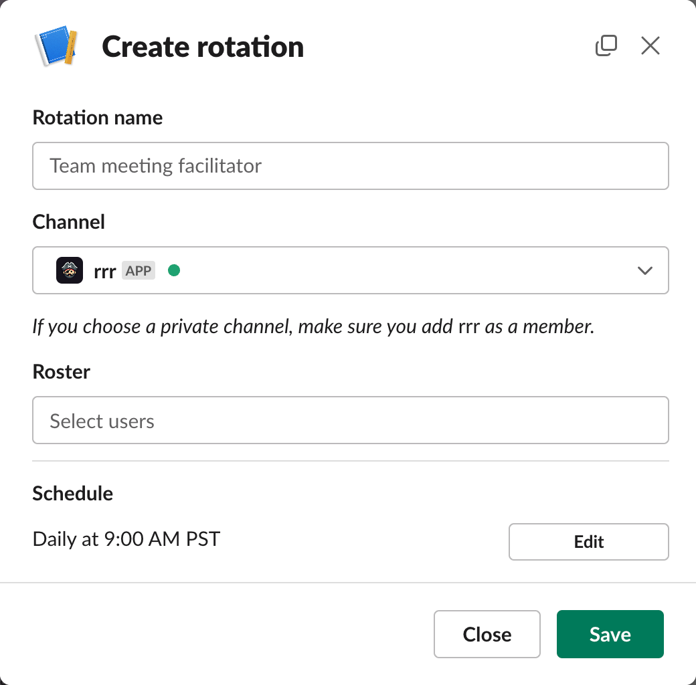
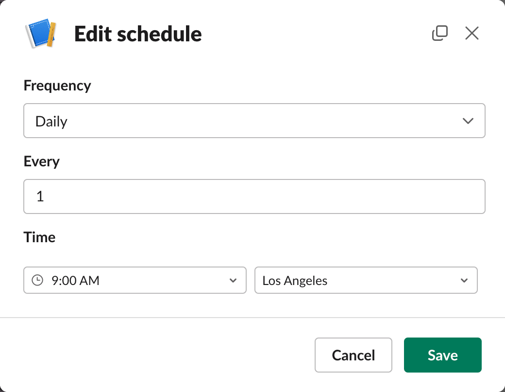

<div align="center">
  

  <h1>rrr</h1>

  <p>A <strong>r</strong>ound <strong>r</strong>obin <strong>r</strong>otation app for pirates. A<strong>rrr</strong>gh!</p>

[](https://www.gnu.org/licenses/gpl-3.0)

</div>

Built on Slack’s Deno-based next-generation app platform, this app allows you to create on-call rotations for your team. It’s useful for things like:

- Support shifts
- Meeting facilitation
- And more

There are many apps that do this already, but this one is open source and free[\*](#pricing) to use. It’s also a great way to learn about the next-generation platform.

## Features

- Create and manage rotations without leaving Slack
- Flexible scheduling with daily, weekly, and monthly options
- Postpone or skip turns
- Manual timezone configuration

## Installation

Currently **rrr** is not available for download on the [App Directory][Slack App Directory]. From [Slack’s documentation][Slack App Directory docs]:

> Next-generation Slack apps are currently not eligible for distributing to the App Directory.

That said, you still need to be on a paid Slack plan to use this app. If you are and have the necessary permissions, you can install the app to your workspace by following these steps.

1. Install the Slack CLI:

   macOS/Linux:

   ```sh
   curl -fsSL https://downloads.slack-edge.com/slack-cli/install.sh | bash # or zsh
   ```

   Windows (PowerShell):

   ```ps
   irm https://downloads.slack-edge.com/slack-cli/install-windows.ps1 | iex
   ```

   This will install all the necessary dependencies, including Deno.

2. Log in to your workspace using the CLI:

   ```sh
   slack login
   ```

3. Clone or download this repository.

   ```sh
   git clone https://github.com/moltinginstar/rrr.git
   ```

4. Then, from the root of the repository, run:

   ```sh
   slack deploy
   ```

   This will install the app to your workspace.

5. Before you can use the app, you also need to install the triggers one by one, by running this command for each of the triggers in the `triggers` directory:

   ```sh
   slack trigger create --trigger-def triggers/<trigger_name>.ts
   ```

And that’s it! You can now use the app in your workspace. For more information on installing apps, see [Slack’s quickstart guide][Slack next-gen platform dev guide] for developing on the next-generation platform.

## Usage

### Gallery






### Pricing

Keep in mind that running custom Slack workflows (like the ones used in this app) costs money.

If you’re on the Pro plan, for instance, you get 1,000 free runs per month, with each additional run costing $0.05. Runs include creating, listing, and deleting rotations, among other things.

Refer to [Slack’s Help Center][Slack custom workflow pricing] for up-to-date pricing information.

## Roadmap

The next-generation platform is still very much in development, and there are many features that are still missing.

I did not know this when I started building this app, but I did my best to work around these limitations.

It may be a while before the platform is ready for production use (especially given my low time commitment) but I will continue to update this app as the platform evolves. See the [open issues][Open issues] for a full list of planned features and known issues.

## Contributing

Any contributions you make are **greatly appreciated**. Especially in the form of PRs, but also in the form of feedback, bug reports, feature requests, and so on. 🤗

[Open issues]: https://github.com/moltinginstar/rrr/issues
[Slack App Directory]: https://slack.com/apps
[Slack App Directory docs]: https://web.archive.org/web/20240118150053/https://api.slack.com/reference/slack-apps/directory-submission-checklist
[Slack next-gen platform dev guide]: https://api.slack.com/automation/quickstart
[Slack custom workflow pricing]: https://slack.com/help/articles/15363357403411-Guide-to-Slack-platform-features-and-pricing
